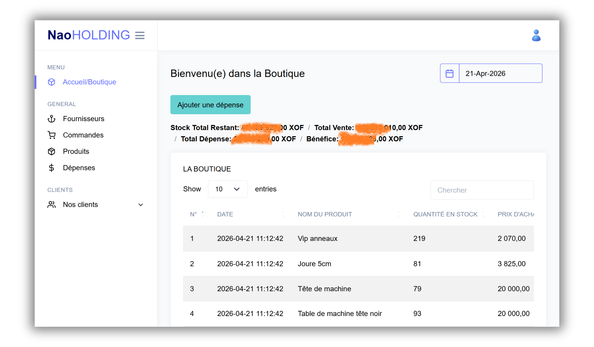
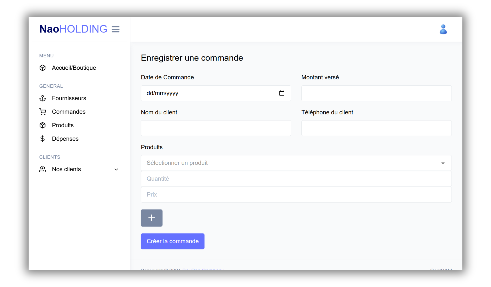
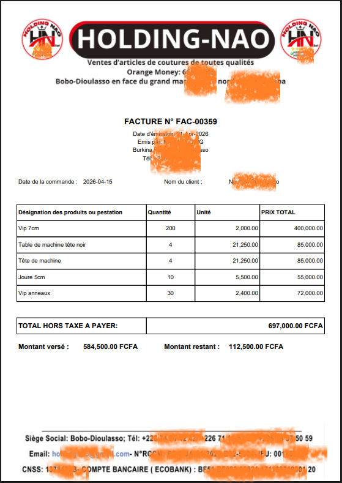

# 🏪 GestSam — Système de Gestion Commerciale

> Application web de gestion commerciale complète pour petites et moyennes entreprises, développée avec **Laravel 11** — actuellement en production et utilisée quotidiennement par des commerçants.

   

🇬🇧 [English version](README.md)

---

## 📌 Présentation

**GestSam** est une application de gestion interne pensée pour le suivi quotidien d'une activité commerciale. Elle couvre l'ensemble du cycle de vente : de la gestion des stocks produits jusqu'à la facturation client, en passant par le suivi des commandes, des dépenses et des fournisseurs.

Le projet a été réalisé pour **NAO Holding** (Burkina Faso / Bobo-Dioulasso) et est **actuellement en production**, hébergé sur **Hostinger**, utilisé au quotidien par les équipes commerciales de l'entreprise.

---

## ✨ Fonctionnalités principales

### 📦 Gestion des produits & stocks
- Ajout, modification et suppression de produits
- Suivi en temps réel des quantités disponibles
- Rattachement automatique à un fournisseur (création à la volée si inexistant)
- Protection contre les stocks négatifs (validation au niveau du modèle)
- Vue globale de la valeur du stock restant (quantité × prix d'achat)

### 🛒 Gestion des commandes
- Création de commandes multi-produits avec sélection dynamique
- Vérification de disponibilité du stock avant validation
- Calcul automatique du total, du montant payé et du reliquat
- Statuts de commande : **En cours**, **Soldé**, **Annulée**
- Annulation avec restauration automatique des stocks et recalcul des dettes client
- Modification complète d'une commande existante (mise à jour du stock et de la dette)

### 🧾 Facturation PDF
- Génération de factures au format PDF via **FPDF**
- En-tête et pied de page personnalisés avec image de la société
- Numéro de facture formaté (`FAC-00001`)
- Détail des produits, totaux, montant versé et reste à payer

### 👥 Gestion des clients
- Création automatique du client à la première commande
- Suivi du solde de dette par client
- Mise à jour manuelle des informations client

### 🏭 Gestion des fournisseurs
- Enregistrement des fournisseurs (nom, téléphone)
- Création à la volée lors de l'ajout d'un produit

### 💸 Gestion des dépenses
- Enregistrement des dépenses opérationnelles (intitulé, montant, date)
- Intégration dans le calcul global du bénéfice

### 📊 Tableau de bord
- Vue synthétique : total des ventes, total des achats, dépenses, **bénéfice net**
- Valeur du stock restant
- Historique des lignes de commande et des dépenses

---

## 📸 Capture d'ecran

### Tableau de bord
<p align="center">
  
</p>

### Commande
<p align="center">
  
</p>

### Facture PDF
<p align="center">
  
</p>


---

## 🗂️ Architecture du projet

```
gestsam/
├── app/
│   ├── Http/
│   │   ├── Controllers/
│   │   │   ├── CommandeController.php   # Logique commandes + facturation
│   │   │   ├── ProduitController.php    # Produits, fournisseurs, dépenses, dashboard
│   │   │   ├── ClientController.php     # CRUD clients
│   │   │   └── UserController.php       # Authentification
│   │   └── Requests/                    # Form Requests (validation)
│   ├── Models/
│   │   ├── Commande.php
│   │   ├── CommandeProduit.php          # Table pivot commandes ↔ produits
│   │   ├── Produit.php
│   │   ├── Client.php
│   │   ├── Fournisseur.php
│   │   └── Depense.php
│   └── Policies/
│       └── ClientPolicy.php
├── database/
│   └── migrations/                      # 8 migrations structurant le schéma
├── resources/views/
│   ├── commande/                        # Création, liste, détail, édition
│   ├── produit/
│   ├── client/
│   ├── fournisseur/
│   ├── depense/
│   ├── facture/
│   └── dashboard.blade.php
└── routes/web.php                       # Toutes les routes protégées par auth
```

---

## 🗄️ Modèle de données

```
Fournisseur  ──< Produit >──< CommandeProduit >── Commande >── Client
                                                      │
                                                 (prix_vente, quantite)

Depense  (indépendant, agrégé dans le dashboard)
```

Les relations clés :
- Un **Client** peut avoir plusieurs **Commandes**
- Une **Commande** contient plusieurs **Produits** via la table pivot `commande_produits` (avec `quantite` et `prix_vente` au moment de la vente)
- Un **Produit** appartient à un **Fournisseur**

---

## 🛠️ Stack technique

| Couche | Technologie |
|--------|-------------|
| Backend | **Laravel 11** (PHP 8.x) |
| Base de données | **MySQL** (production) / SQLite (dev) |
| Hébergement | **Hostinger** (shared hosting) |
| PDF | **FPDF** via `codedge/laravel-fpdf` |
| Frontend | **Blade** + Bootstrap + TinyMCE |
| Authentification | Laravel Auth (sessions) + Policies |
| ORM | Eloquent (avec transactions DB) |

---

## 🔐 Sécurité & robustesse

- Toutes les routes sont protégées par le middleware `auth`
- Les opérations critiques (création/annulation/modification de commande) utilisent des **transactions DB** avec rollback en cas d'erreur
- Validation des requêtes via `FormRequest` et règles inline
- Protection contre les stocks négatifs au niveau du modèle (`booted()`)
- Politique d'autorisation via `ClientPolicy`

---

## 👨‍💻 Ce que ce projet démontre

- Maîtrise du framework **Laravel** (routing, Eloquent, Blade, middleware, policies, form requests)
- Gestion de la **logique métier complexe** : stock, dette client, annulation avec effets de bord
- Génération de **documents PDF** personnalisés (factures prêtes à l'impression)
- Utilisation des **transactions de base de données** pour garantir l'intégrité des données
- Architecture MVC claire et séparation des responsabilités
- **Déploiement réel** sur hébergement mutualisé Hostinger avec Laravel
- Capacité à livrer une application complète, opérationnelle et utilisée en conditions réelles

---

## ⚖️ Propriété intellectuelle

© 2024 Kounabé Paulin MIEN. Projet réalisé pour NAO Holding.  
Ce dépôt est publié à des fins de démonstration uniquement.  
Le code source ne peut être copié, modifié ou réutilisé sans autorisation explicite.
